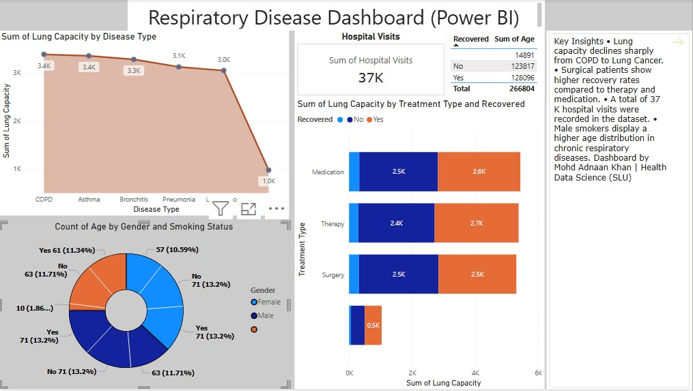

## Respiratory Disease Dashboard
This Power BI dashboard analyzes respiratory disease trends and patient outcomes using healthcare data. The dashboard provides interactive insights into disease prevalence, hospital visits, treatment effectiveness, recovery outcomes, and demographic distribution.

### Project Objectives
- Analyze respiratory disease patterns across different disease categories
- Evaluate hospital visit volume and patient outcomes
- Compare treatment approaches and recovery rates
- Explore relationships between age, gender, and smoking status
- Identify healthcare KPIs for respiratory disease management

### Dashboard Features
- Disease-wise Lung Capacity Analysis
- Total Hospital Visit Monitoring (37K visits)
- Treatment Type vs Recovery Comparison
- Recovery Distribution Analysis
- Demographic Insights by Age and Gender
- Smoking Status Impact Assessment

### Key Insights
- Total hospital visits analyzed: **37K**
- Lung capacity gradually declines across severe respiratory conditions
- Medication and therapy contributed to higher recovery counts
- Recovery outcomes vary by treatment type
- Patient demographics indicate noticeable variation across age and smoking behavior
- Dashboard supports healthcare decision-making and population health analysis

### Preview

---

## Depression & Anxiety Analysis Dashboard

This Power BI dashboard explores relationships between mental health indicators and physical wellness factors to understand patterns associated with depression and anxiety severity.
The analysis combines PHQ (Patient Health Questionnaire), GAD (Generalized Anxiety Disorder), BMI, sleep behavior, age, and demographic variables to generate healthcare insights.

### Project Objectives
- Analyze depression severity using PHQ scores
- Evaluate anxiety levels using GAD scores
- Explore relationships between BMI and mental health
- Study sleepiness impact on anxiety outcomes
- Identify demographic trends across age and gender

### Dashboard Features
- PHQ Score KPI Visualization
- Anxiety Severity vs BMI Comparison
- Sleepiness vs GAD Score Analysis
- Age Distribution Across BMI Categories
- Gender-Based Mental Health Insights
- Interactive Healthcare Dashboard Design

### Key Insights
- Average PHQ score: **7.12**, indicating mild depressive symptoms
- Moderate anxiety group demonstrated higher BMI values
- Sleepiness showed association with elevated anxiety levels
- Majority of participants were concentrated within overweight BMI categories
- Female participants displayed slightly lower average BMI compared to males
- Mental and physical health indicators showed measurable interaction patterns

### Preview

